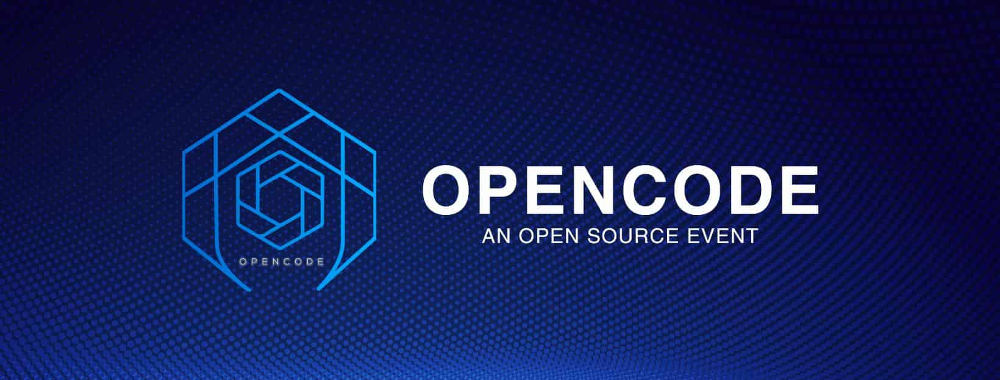

# Opencode Collaborative 2019

Chat with us on [Slack](https://opencodeiiita.slack.com)  
Like us on [Facebook](https://www.facebook.com/opencodeiiita/)

## About us

## Requirements:

- GitHub Account 
- Git

#### Setting up git:

- [Download and install the latest version of Git.](https://git-scm.com/downloads)
- [Set your username in Git.](https://help.github.com/articles/setting-your-username-in-git)
- [Set your commit email address in Git.](https://help.github.com/articles/setting-your-commit-email-address-in-git)

## Contributing
 
#### Getting started

We will follow the official GitHub documentation for setting up the repo.

- Forking and cloning the repository
   
    > [Link to GitHub Docs](https://help.github.com/articles/fork-a-repo/#step-2-create-a-local-clone-of-your-fork)

    By forking a repository you create your own copy of the project and make your changes there. Cloning a project means that you are setting up the project on your local system.

- Syncing a fork

    > [Link to GitHub docs](https://help.github.com/articles/syncing-a-fork/)

    We keep our fork in sync to the original repository so that our copy of the project has the latest changes from the original project.

- Making changes to project and committing a change

    > [Link to docs](https://dont-be-afraid-to-commit.readthedocs.io/en/latest/git/commandlinegit.html#commit-your-changes)

    Committing means making changes to the project and adding your changes to the GitHub.

- Making a pull request

    > [Link to docs](https://help.github.com/articles/about-pull-requests/)

    Pull request means submitting your changes to the original project for the review. Once the maintainers of the project feel that your changes are appropriate then your pull request will be merged.

**Note**: In case you feel any issue during setting up the project or using git, don't hesitate to ask us on our slack channel. We will help you out.

## Claiming up an issue

- To claim an issue please comment on the issue as `@opencodebot claim` and the bot will assign you the issue. 

## Guidelines and Best practices

Please help us follow the best practice to make it easy for the reviewer as well as the contributor. We want to focus on the code quality more than on managing pull request ethics.

* People before code: If any of the following rules are violated, the pull-requests must not be rejected. This is to create an easy and joyful onboarding process for new programmers and first-time contributors.

* Single commit per pull request and name the commit as something meaningful, example: Adding <-your-name-> in students/mentors section.

* Reference the issue numbers in the commit message if it resolves an open issue. Follow the pattern Fixes #<issue number> <commit message>

* Provide the link to live gh-pages from your forked repository or relevant screenshot for easier review.

* Pull Request older than 3 days with no response from the contributor shall be marked closed.

* Do not make PR which is not related to any issues. You can create an issue and solve it once we approve them.

* Avoid duplicate PRs, if need be comment on the older PR with the PR number of the follow-up (new PR) and close the obsolete PR yourself.

* Be polite: Be polite to other community members.

* Communicate: Whether you are working on a new feature or facing a doubt please feel free to ask us on our slack channel. We will be happy to help you out.

### Happy Coding :v: